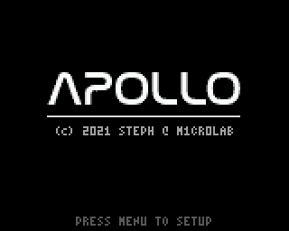
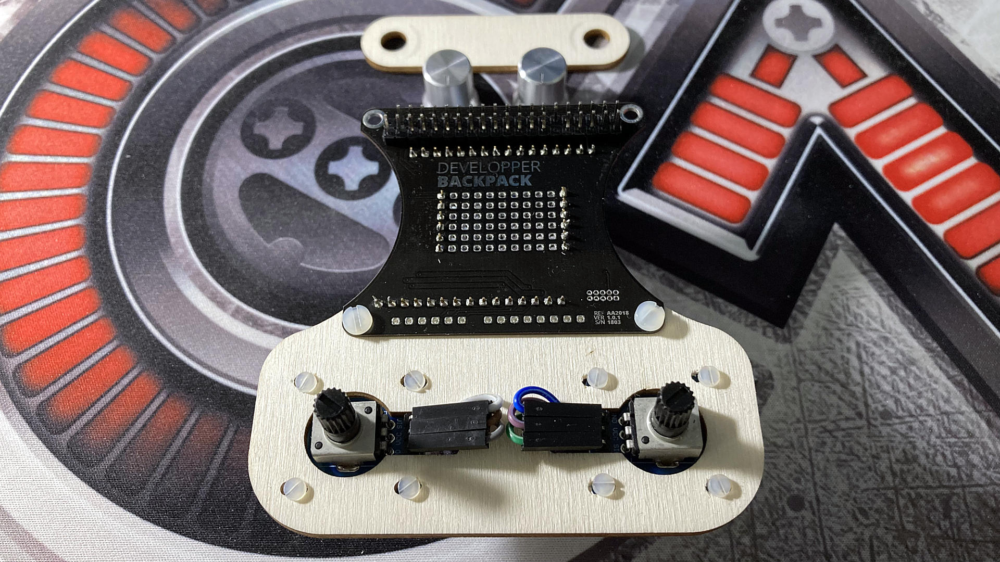
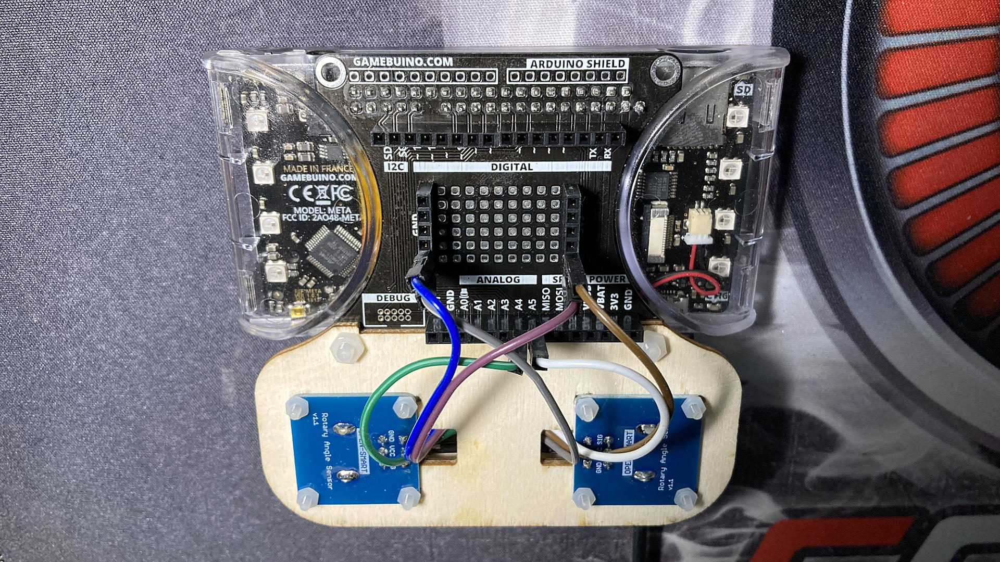
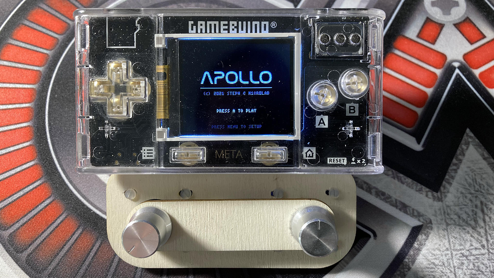

# Apollo - un jeu pour la Gamebuino META

## Le principe du jeu

Propulsé dans le passé, à l'époque de la conquête la plus folle de l'histoire de l'Humanité, vous intégrez le programme spatial Apollo de la NASA, lancé par le président John F. Kennedy en 1961. Huit années après son lancement, vous incarnez le célèbre astronaute Neil Armstrong, commandant d'Apollo 11, et votre mission est de parvenir à poser le module lunaire habité sur la surface de la Lune, ce qu'aucun être humain n'est parvenu à faire jusque là. Les manoeuvres de pilotage relèvent d'une précision hors du commun et il vous reste peu de temps pour vous préparer avant le décollage du lanceur Saturn V. Les ingénieurs de la NASA ont mis au point un simulateur très sophistiqué pour vous entraîner et développer votre dextérité, nécessaire au succès de cette mission extrêmement périlleuse.

Vous disposez de 3 modules lunaires avec des réservoirs pleins de peroxyde d'azote et d'Aérozine 50. Votre objectif est d'effectuer autant d'alunissages que possible avec ces ressources combustibles limitées. Attention, les manoeuvres d'approche du sol lunaire doivent impérativement se faire en douceur pour ne pas risquer la catastrophe et précipiter votre équipage vers une issue fatale provoquée par l'explosion du module lunaire.

Tous les sites d'alunissage ne vous exposeront pas aux mêmes difficultés et vous serez largement récompensé si vous parvenez à alunir sur les plus étroits d'entre eux. La récompense obtenue à chaque alunissage est également inversement proportionnelle à la durée écoulée pendant toute la phase d'approche.

Le simulateur est équipé de deux systèmes de navigation radicalement différents. Le premier, beaucoup plus simple, vous permettra de contrôler l'alunissage avec les boutons standards de la META et bénéficier d'une assistance à la navigation :

- Le PAD directionnel vous permettra d'activer les propulseurs latéraux qui feront pivoter le module autour de son centre de gravité, dans un sens ou son contraire, et donc de contrôler son inclinaison.

- Le bouton A vous permettra d'activer le propulseur principal pour développer une puissante poussée et vous opposer à la gravité de la Lune.

Relâchez simplement les boutons pour désactiver l'allumage des propulseurs.

Lorsque vous serez aguerri aux manoeuvres d'approche, vous pourrez basculer sur le second système de navigation réservé aux experts, beaucoup plus précis, mais beaucoup plus délicat à maîtriser :

- Un potentiomètre rotatif vous permettra d'activer les propulseurs latéraux avec plus ou moins de puissance pour doser la rotation du module lunaire. Prenez garde à bien repositionner le potentiomètre à mi-course pour désactiver le système d'allumage des propulseurs et stabiliser l'inclinaison du module lunaire.

- Un autre potentiomètres rotatif vous permettra d'activer le propulseur principal en ajustant précisément la poussée à appliquer au module lunaire pour un meilleur contrôle de la consommation du carburant pendant vos manoeuvres d'approche.

L'allumage des propulseurs consommera nécessairement du carburant, mais n'oubliez pas que vous ne disposez que d'une quantité limitée de ce précieux mélange pour contrôler le module lunaire. Une fois vos réserves épuisées, vous ne pourrez plus rien contrôler et le crash sera certainement inévitable...

## Commandes principales

## Montage et branchement des potentiomètres

Pour pouvoir profiter du mode expert de navigation, vous devrez disposer de deux potentiomètres rotatifs et du Developer Backpack Gamebuino, disponibles dans le [pack d'accessoires officiel][kit]. Les broches de lecture `SIG` des potentiomètres devront respectivement être raccordées aux entrées analogiques du Developer Backpack de la manière suivante :

- `A5`: potentiomètre de gauche (Thrust)
- `A4`: potentiomètre de droite (Tilt Left & Right)

Pour une meilleure ergonomie en cours de partie, je vous conseille d'orienter vos potentiomètres comme indiqué sur la photo ci-dessus :

- Le potentiomètre de gauche, qui commande le propulseur principal, doit être positionné en début de course (rotation complète à gauche) pour une poussée de puissance nulle.

- Le potentiomètres de droite, qui commande les propulseurs latéraux, doit être positionné à mi-course pour ne déclencher aucune rotation du module lunaire, ni vers la gauche, ni vers la droite.

[kit]:  https://shop.gamebuino.com/fr/accessoires/73-pack-accessoires-pour-gamebuino.html