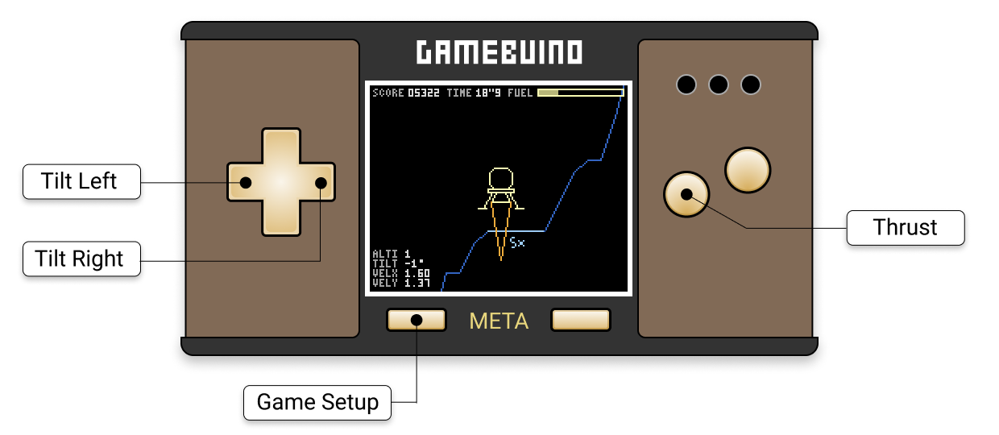
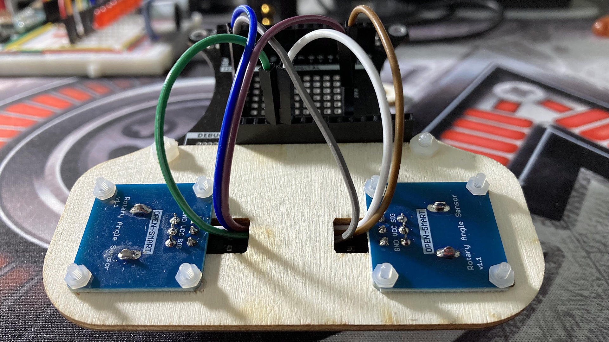

# Apollo - a tiny game for the Gamebuino META

&raquo; [Version française][fr]

If you like this game, please leave me a :sparkling_heart:

- [On the official game page][gbc], on the **Gamebuino** website.
- [On the official announcement of the game][gbf], on the **Gamebuino** forum.

## The story of the game

Propelled into the past, at the time of the craziest conquest in the history of mankind, you join NASA's Apollo space program, launched by President John F. Kennedy in 1961. Eight years after its launch, you play the famous astronaut Neil Armstrong, commander of Apollo 11, and your mission is to land the manned lunar module on the surface of the Moon, which no human being has managed to do until now. The piloting maneuvers are extremely precise and you have little time to prepare before the Saturn V launch vehicle takes off. NASA engineers have developed a highly sophisticated simulator to train and develop the dexterity needed to succeed in this extremely dangerous mission.

You have 3 lunar modules with tanks full of nitrogen peroxide and Aerosol 50. Your objective is to perform as many lunar landings as possible with these limited fuel resources. Be careful, the approach maneuvers to the lunar ground must be done smoothly to avoid the risk of disaster and precipitate your crew towards a fatal outcome caused by the explosion of the lunar module.

Not all landing sites will be equally difficult and you will be rewarded greatly if you manage to land on the narrowest of them. The reward for each landing is also inversely proportional to the time spent during the entire approach phase.

The simulator is equipped with two radically different navigation systems. The first one, much simpler, will allow you to control the landing with the standard META buttons and benefit from a navigation assistance:

- The directional PAD will allow you to activate the lateral thrusters that will rotate the module around its center of gravity, in one direction or its opposite, and thus control its inclination.

- The A button will allow you to activate the main thruster to develop a powerful thrust and oppose the Moon's gravity.

Simply release the buttons to turn off the thruster ignition.

Once you've mastered the approach maneuvers, you can switch to the second navigation system reserved for experts, which is much more precise, but much more difficult to master:

- A rotary potentiometer will allow you to activate the lateral thrusters with more or less power to control the rotation of the lunar module. Be careful to reposition the potentiometer halfway to deactivate the thrusters ignition system and stabilize the lunar module inclination.

- Another rotary potentiometer will allow you to activate the main thruster by precisely adjusting the thrust to be applied to the lunar module for a better control of the fuel consumption during your approach maneuvers.

The ignition of the thrusters will necessarily consume fuel, but don't forget that you only have a limited amount of this precious mixture to control the lunar module. Once your supplies are exhausted, you will not be able to control anything and the crash will certainly be inevitable...

## Main controls

## Assembly and connection of the potentiometers

In order to take advantage of the expert navigation mode, you will need two rotary potentiometers and the Gamebuino Developer Backpack, available in the [official accessory pack][kit]. The `SIG` readout pins of the rotary potentiometers should be connected to the analog inputs of the Developer Backpack as follows:

- `A5`: left potentiometer (Thrust)
- `A4`: right potentiometer (Tilt Left & Right)

For a better ergonomics during the game, I advise you to orientate your rotary knobs as shown on the picture above:

- The left potentiometer, which controls the main thruster, should be positioned at the beginning of the stroke (full left rotation) for a zero power thrust.

- The right potentiometer, which controls the lateral thrusters, must be positioned at the halfway point so as not to trigger any rotation of the lunar module, neither to the left nor to the right.

If you like this game, please leave me a :sparkling_heart:

- [On the official game page][gbc], on the **Gamebuino** website.
- [On the official announcement of the game][gbf], on the **Gamebuino** forum.

[fr]:  Readme-fr.md
[kit]: https://shop.gamebuino.com/fr/accessoires/73-pack-accessoires-pour-gamebuino.html
[gbc]: https://gamebuino.com/creations/apollo
[gbf]: https://community.gamebuino.com/t/new-creation-apollo-by-steph/237